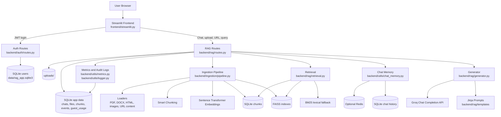

# Architecture Diagram

The application is split into a Streamlit UI, a FastAPI backend, local persistence, document ingestion, retrieval, and LLM generation.

## Request Flow

### Authentication

1. The frontend posts credentials to `/login`.
2. The backend validates the password using Passlib.
3. A JWT is returned with `sub` and `role`.
4. Subsequent frontend requests send the JWT as a bearer token.

### File or URL Ingestion

1. A manager, analyst, or admin uploads a file or submits a URL.
2. The backend extracts text with the matching loader.
3. Text is split into chunks.
4. Chunks are embedded.
5. Chunk metadata is stored in SQLite.
6. Embeddings are appended to the chat's FAISS index.
7. File or URL metadata is recorded so other allowed users can select it later.

### Query Answering

1. The frontend posts a query and `chat_id` to `/query`.
2. Guest quota and rate limits are checked.
3. The backend loads chat memory and indexed chunks.
4. Retrieval combines FAISS semantic search with BM25 lexical scoring.
5. Top chunks are inserted into a Jinja prompt.
6. Groq generates the answer.
7. The answer, sources, telemetry, and guest usage metadata are returned to the frontend.

## Main Modules

- `backend/main.py`: FastAPI app setup and router registration.
- `backend/auth/`: login, JWTs, password hashing, role hierarchy, and user management.
- `backend/rag/routes.py`: upload, URL ingestion, query, audit, chat, and file APIs.
- `backend/ingestion/`: file loaders, chunking, embeddings, and FAISS indexing.
- `backend/rag/retrieval.py`: semantic and lexical retrieval.
- `backend/rag/generator.py`: prompt rendering and Groq generation.
- `backend/utils/`: persistence helpers, metrics, audit logs, guest limits, chat memory.
- `frontend/streamlit.py`: complete UI for login, chats, ingestion, dashboards, and querying.

